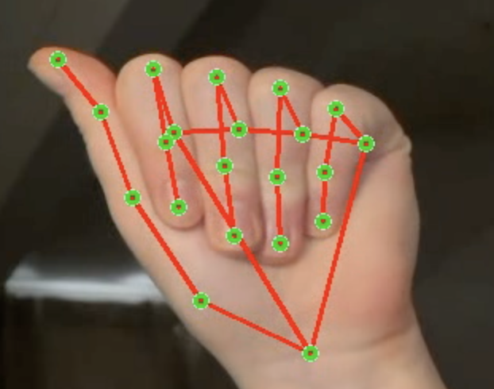

# SignNet - a Live Camera ASL Alphabet Classifer
**CS 4701 Practicum in AI Project**

**Authors: Bella Falkenberg and Alexa Sheldon**

This project implements a Multi-Layer Perceptron and a Convolutional Neural Network to classify letters from the ASL hand sign alphabet from a live camera feed.

## Features
- **Live Camera**: uses your computer's camera (or your iPhone) for live feed, overlaying classification from both MLP and CNN models.
- **Multi-Layer Perceptron (MLP) Classification**: trained on hand embeddings from Mediapipe to make classifications of ASL fingerspelling alphabet.
- **Convolutional Neural Network (CNN) Classification**: trained on cropped images based on locations of `MediaPipe` landmarks to make classifications of ASL fingerspelling alphabet.
- **MediaPipe Hand Skeleton Overlay**: draws `MediaPipe` landmarks over your hand in frame.


## Setup Instructions
### 1. Clone the repository (different for windows)
```bash
git clone git@github.com:alexasheldon/cs4701-ai-proj.git
cd cs4701-ai-proj
```
### 2. Install xcode command line tools (skip on Windows)
```bash
xcode-select --install
```
### 3. Install Miniforge (how we set up conda)
Make sure you download the correct one for your architecture. You can also go to the [release page](https://github.com/conda-forge/miniforge/releases) if you have a different architecture (notably not Mac) to get one that matches with your computer.
Make sure you both download and run it to be able to make sure of it.
```bash
uname -m
```
If returns `x86_64` -> Intel: 
```bash
curl -L -o /tmp/Miniforge3-25.11.0-0-MacOSX-x86_64.sh https://github.com/conda-forge/miniforge/releases/download/25.11.0-0/Miniforge3-25.11.0-0-MacOSX-x86_64.sh
bash Miniforge3-25.11.0-0-MacOSX-x86_64.sh -b -p ~/miniforge3
```
If `arm64` -> Apple Silicon (M1/M2)
```bash
curl -L -o /tmp/Miniforge3-25.11.0-0-MacOSX-arm64.sh https://github.com/conda-forge/miniforge/releases/download/25.11.0-0/Miniforge3-25.11.0-0-MacOSX-arm64.sh
bash Miniforge3-25.11.0-0-MacOSX-arm64.sh -b -p ~/miniforge3
```

### 4. Create `conda` environment from `asl-native.yml`
```bash
conda env create -f asl-native.yml
```
### 5. Activate the environment by either:
```bash
source ~/miniforge3/bin/activate asl-native
```
or
```bash
conda activate asl-native
```
If conda was initialized by the installer or using Windows.
### 6. Reinstall platform specific packages
```bash
conda install -c conda-forge opencv
python -m pip install --upgrade pip setuptools wheel
python -m pip install mediapipe
```

### 7. Interact with our live camera!
```bash
python live_camera.py
```

## How to Use Live Camera
Feel free to update global variables as needed.
- **CAM_INDEX**: currently set to 0, but your computer may not have a camera at index 0. Most computers do, and sometimes Apple computers will pull up camera feed from your phone. If it's not working, feel free to change the index, but usually the blocker is allowing permission for access.
- **FRAME_WIDTH** and **FRAME_HEIGHT**: currently set to 1280 x 720, but you can alter this to be a better resolution for you
- **record_video** (not a global variable): boolean indicating whether you'd like to record and save a video of the live camera feed. You can find it at the bottom of the code.

## Acknowledgments
- Makes use of `MediaPipe` (tracking hand landmarks) and `opencv` (capturing video)
- The CNN and MLP were trained on [this synthetic dataset](https://www.kaggle.com/datasets/lexset/synthetic-asl-alphabet).
- This project was developed with teaching/assistance from Copilot and Chat-GPT.

---